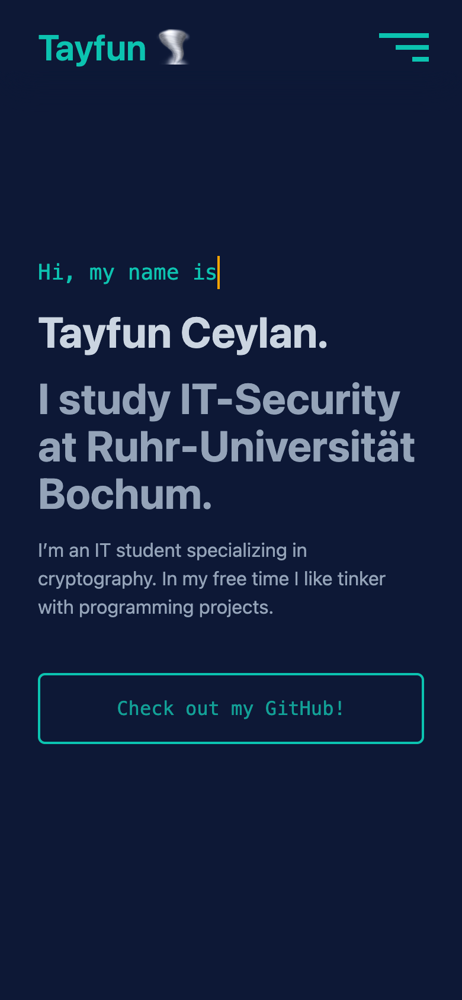
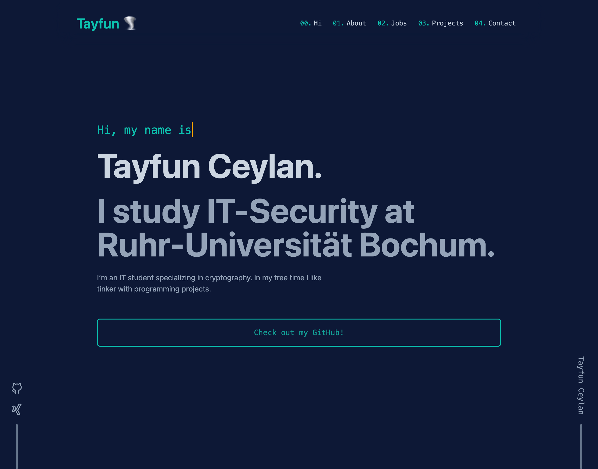

# Portfolio

Hello, this is my personal homepage. In this project, I want to learn Svelte, TypeScript, Tailwind CSS and Docker Dev Container.
The goal of this project is to enhance my skills and having fun along the way.

## Features

- **fully customizable** text through a single configuration file so you can easily change the text without touching the code
- **devcontainer**: get started easily with all tools and extensions
- works almost entirely without JavaScript
- small build size/bundle size of only 360kb
- responsive design with **animations** and **transitions**
- optimized for both mobile and desktop

## How does it look like?

    
    

## Dev Container

This repository provides a dev container with all necessary tools to have a consistent and pleasant development experience.
Just open the repository in Visual Studio Code and you will be prompted to open the repository in a dev container.
It will automatically install all necessary tools and extensions.
After that tpye localhost in your browser to see the homepage.

## Without Dev Container

- Install pnpm (npm should work too) and run `pnpm install` to install all dependencies.
- Then run `pnpm dev` to start the development server.
- Run `pnpm build` to build the static site.

## Troubleshooting

### Sharing Git credentials with your container

At first I was getting a permission denied error when trying to push.

After running `ssh-add` on the host, the issue was resolved.
This is documented in vs code's documentation – [Sharing Git credentials with your container](https://code.visualstudio.com/remote/advancedcontainers/sharing-git-credentials).

## Building a static site for production

To build a static site, you can either:

- run `pnpm run build` inside the dev container
- or just run `docker compose up`

Both methods will generate the static site in the `build` directory.
